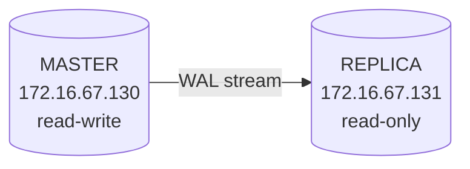

# PostgreSQL Streaming Replication Setup Guide

Complete step-by-step guide to configure **physical streaming replication**
(one master + one replica) for the PostgreSQL cluster deployed by this Ansible
playbook.

## Overview

This guide sets up **physical streaming replication**, which creates a
byte-for-byte copy of the **entire cluster** (all databases, roles, and
settings) on the replica. The replica is **read-only** and continuously
receives WAL changes from the master.



## Environment Reference

| Item                | Value                          |
| ------------------- | ------------------------------ |
| PostgreSQL version  | `18`                           |
| Master IP           | `172.16.67.130`                |
| Replica IP          | `172.16.67.131`                |
| Data directory      | `/var/lib/postgresql/18/main`  |
| Config directory    | `/etc/postgresql/18/main`      |
| Port                | `5432`                         |
| Replication user    | `replicator`                   |
| Replication slot    | `replica1_slot`                |

> Replace IPs, version, and passwords with your actual values.

---

## Prerequisites

Run the Ansible playbook so PostgreSQL is installed on **both** nodes:

```bash
# Install and base-configure PostgreSQL on BOTH nodes
ansible-playbook -i inventory site.yml --tags "install,configure"

# Create application database/user ONLY on the master
ansible-playbook -i inventory site.yml --tags "users,databases" --limit pg_host1
```

Verify connectivity between the two nodes and that port `5432` is reachable.

> ⚠️ **Important:** After completing this guide, do **not** re-run the playbook
> against these nodes. The `postgresql.conf` and `pg_hba.conf` templates will
> overwrite your replication settings. If you must re-run it, add the
> replication settings to the playbook variables first (see
> [Appendix A](#appendix-a--persisting-settings-in-ansible)).

---

## Part 1 — Configure the MASTER

### Step 1.1 — Create the replication role

```bash
sudo -u postgres psql -c "CREATE ROLE replicator WITH REPLICATION LOGIN PASSWORD 'StrongReplPass123';"
```

### Step 1.2 — Verify WAL settings

The playbook already sets these in `/etc/postgresql/18/main/postgresql.conf`.
Confirm they are present:

```conf
listen_addresses = '*'
wal_level        = replica
max_wal_senders  = 3
wal_keep_size    = 64MB
```

> For added safety against WAL recycling, you may increase `wal_keep_size`
> (e.g. `512MB`) or rely on a replication slot (Step 1.4).

### Step 1.3 — Allow the replica in `pg_hba.conf`

Edit `/etc/postgresql/18/main/pg_hba.conf` and add this line at the end:

```conf
# Allow replica to connect for streaming replication
host    replication    replicator    172.16.67.131/32    scram-sha-256
```

> If your server uses `md5` authentication, use `md5` instead of
> `scram-sha-256`.

### Step 1.4 — Create a physical replication slot (recommended)

A slot prevents the master from removing WAL files the replica still needs.

```bash
sudo -u postgres psql -c "SELECT pg_create_physical_replication_slot('replica1_slot');"
```

### Step 1.5 — Apply changes

```bash
# wal_level and max_wal_senders require a restart
sudo systemctl restart postgresql
```

Verify:

```bash
sudo -u postgres psql -c "SHOW wal_level;"
sudo -u postgres psql -c "SELECT slot_name, slot_type FROM pg_replication_slots;"
```

---

## Part 2 — Configure the REPLICA

### Step 2.1 — Stop PostgreSQL

```bash
sudo systemctl stop postgresql
```

### Step 2.2 — Clear the data directory

> ⚠️ This permanently deletes the replica's current data (expected — it will be
> replaced by a copy from the master).

```bash
sudo -u postgres bash -c 'rm -rf /var/lib/postgresql/18/main/*'
```

### Step 2.3 — Take a base backup from the master

**With** replication slot (from Step 1.4):

```bash
sudo -u postgres PGPASSWORD='StrongReplPass123' pg_basebackup \
  -h 172.16.67.130 \
  -U replicator \
  -D /var/lib/postgresql/18/main \
  -Fp -Xs -P -R \
  -S replica1_slot
```

**Without** a slot — remove the `-S replica1_slot` line.

**Flag reference:**

| Flag  | Meaning                                          |
| ----- | ------------------------------------------------ |
| `-Fp` | Plain format (normal data directory layout)      |
| `-Xs` | Stream WAL during the backup                     |
| `-P`  | Show progress                                    |
| `-R`  | Auto-create `standby.signal` & `primary_conninfo`|
| `-S`  | Use the named replication slot                   |

### Step 2.4 — Verify the files created by `-R`

```bash
sudo ls -l /var/lib/postgresql/18/main/standby.signal
sudo cat /var/lib/postgresql/18/main/postgresql.auto.conf
```

You should see a `standby.signal` file and a `primary_conninfo` entry like:

```conf
primary_conninfo = 'user=replicator password=StrongReplPass123 host=172.16.67.130 port=5432 ...'
primary_slot_name = 'replica1_slot'
```

### Step 2.5 — Fix file ownership and permissions

```bash
sudo chown -R postgres:postgres /var/lib/postgresql/18/main
sudo chmod 700 /var/lib/postgresql/18/main
```

### Step 2.6 — Start the replica

```bash
sudo systemctl start postgresql
```

---

## Part 3 — Verify Replication

### On the MASTER

```bash
sudo -u postgres psql -c "SELECT client_addr, state, sync_state FROM pg_stat_replication;"
```

Expected: one row with `client_addr = 172.16.67.131` and `state = streaming`.

### On the REPLICA

```bash
# Returns 't' (true) when the node is in standby/recovery mode
sudo -u postgres psql -c "SELECT pg_is_in_recovery();"
```

### End-to-end test

On the **master**:

```bash
sudo -u postgres psql -d myapp_db -c "CREATE TABLE repl_test(id int); INSERT INTO repl_test VALUES (1);"
```

On the **replica**:

```bash
sudo -u postgres psql -d myapp_db -c "SELECT * FROM repl_test;"
```

If you see `1`, replication is working. ✅

### Check replication lag (optional)

On the **replica**:

```bash
sudo -u postgres psql -c "SELECT now() - pg_last_xact_replay_timestamp() AS replication_lag;"
```

---

## Troubleshooting

| Symptom                                   | Likely cause                                   | Fix                                                   |
| ----------------------------------------- | ---------------------------------------------- | ----------------------------------------------------- |
| `pg_basebackup` authentication error      | Missing/incorrect `pg_hba.conf` line or password | Verify Step 1.3 and the role password; reload master  |
| Connection refused to master              | `listen_addresses` not `*`, or firewall on 5432 | Check `postgresql.conf` and firewall rules            |
| Replica won't start                       | Wrong ownership/permissions on data dir         | Re-run Step 2.5                                       |
| `pg_stat_replication` is empty            | Replica not connecting                          | Check replica logs in `/var/log/postgresql/`          |
| WAL files missing on master               | No slot and `wal_keep_size` too small           | Increase `wal_keep_size` or use a slot                |

Check logs on either node:

```bash
sudo tail -f /var/log/postgresql/postgresql-*.log
```

---

## Failover (Promote the Replica)

If the master fails and you need to promote the replica to become the new
master:

```bash
sudo -u postgres pg_ctlcluster 18 main promote
# or:
sudo -u postgres psql -c "SELECT pg_promote();"
```

After promotion, `pg_is_in_recovery()` returns `f` (false) and the node becomes
read-write.

> ⚠️ After a failover, the old master must be reconfigured as a replica
> (re-run Part 2 against it) before reconnecting it.

---

## Appendix A — Persisting Settings in Ansible

To make the playbook idempotent and avoid wiping replication settings, add the
replication `pg_hba` entry to your inventory or `group_vars`:

```yaml
postgresql_hba_entries:
  - { type: local, database: all, user: postgres, method: peer }
  - { type: local, database: all, user: all, method: md5 }
  - { type: host, database: all, user: all, address: "127.0.0.1/32", method: md5 }
  - { type: host, database: all, user: all, address: "::1/128", method: md5 }
  # Replication access for the replica:
  - { type: host, database: replication, user: replicator, address: "172.16.67.131/32", method: scram-sha-256 }
```

---

## Quick Command Checklist

```text
MASTER
  1. CREATE ROLE replicator WITH REPLICATION LOGIN PASSWORD '...';
  2. verify wal_level=replica, max_wal_senders, wal_keep_size
  3. add pg_hba line: host replication replicator <replica_ip>/32 scram-sha-256
  4. SELECT pg_create_physical_replication_slot('replica1_slot');   (optional)
  5. systemctl restart postgresql

REPLICA
  1. systemctl stop postgresql
  2. rm -rf /var/lib/postgresql/18/main/*
  3. pg_basebackup -h <master> -U replicator -D <datadir> -Fp -Xs -P -R -S replica1_slot
  4. verify standby.signal + postgresql.auto.conf
  5. chown -R postgres:postgres <datadir> && chmod 700 <datadir>
  6. systemctl start postgresql

VERIFY
  master:  SELECT * FROM pg_stat_replication;
  replica: SELECT pg_is_in_recovery();
  test:    write on master -> read on replica
```
